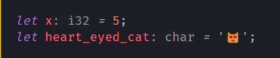
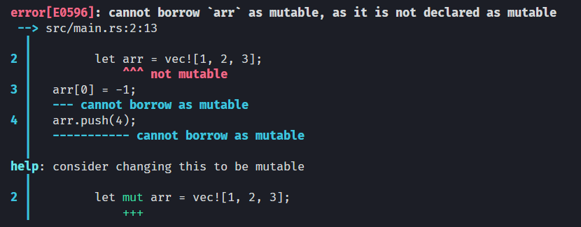
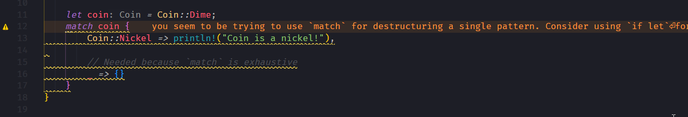
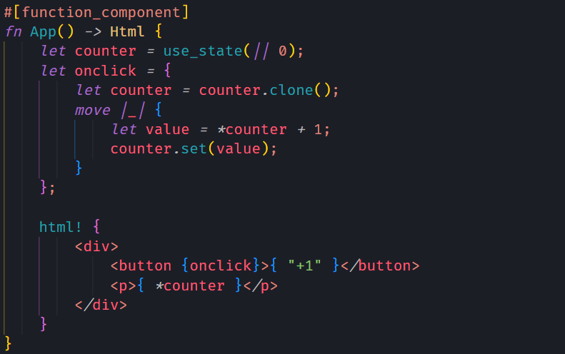
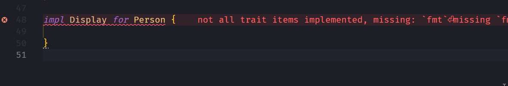
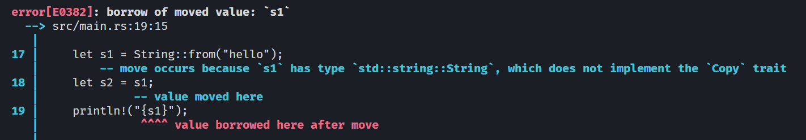
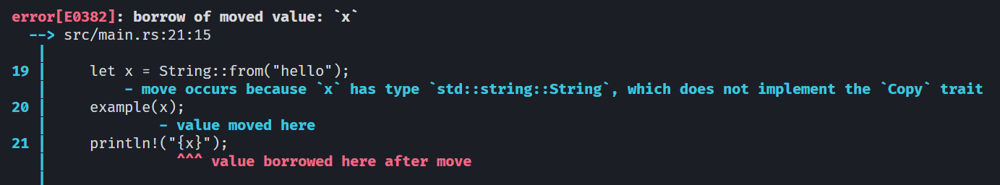
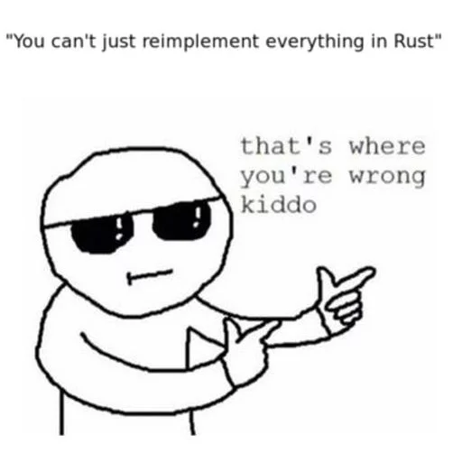
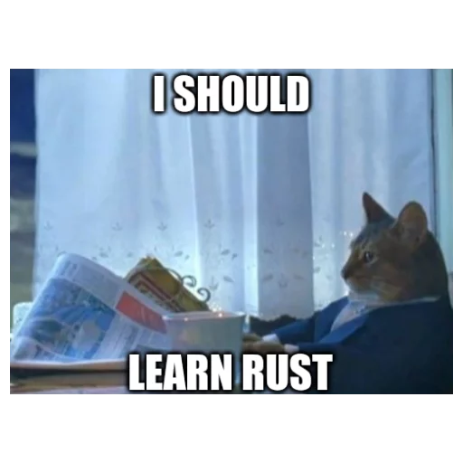

# **The Rust programming language**

From a web developer's perspective

---

# Why build a service in Rust (vs Node.js)?

- Improved performance for computationally intensive tasks
  - [Performance that competes with C](https://benchmarksgame-team.pages.debian.net/benchmarksgame/fastest/rust.html)
  - [Up to an order of magnitude faster than Node.js](https://web-frameworks-benchmark.netlify.app/compare?f=warp,express)
  - Easy, safe multi-threading
- No GC :arrow_right: consistent performance
- Lower memory consumption

---

# Why build a service in Rust (vs Node.js)?

- Uses less resources :arrow_right: serve more users with a given set of resources
- Faster cold start (for serverless applications)
- Programming in Rust is awesome :sunglasses: :crab:

---

# With Rust, you can have your cake and eat it too

- High performance + memory safety
  - Traditionally you had to choose one
  - Unique ownership rules prevent memory management mistakes à la C/C++
- High level concepts + low level control
  - High level "zero cost abstractions" that compile down to performant low-level code with no extra run-time cost
  - Low level control without having to reach for C
- Strong focus on correctness + easy shortcuts for prototyping
  - Forgot to handle errors or missing values? :arrow_right: program won't compile
  - Explicit escape hatches enable quick prototyping (i.e. just let it crash)

---

# Excellent tooling built right in

- Part of the standard Rust distribution:
  - `cargo add` package manager + [package registry](https://crates.io/) (similar to npm)
  - `cargo rustdoc` [generate docs based on inline rustdoc comments :arrow_right: HTML](https://doc.rust-lang.org/stable/std/fs/index.html)
  - `cargo test` unit test runner
  - `cargo run --example` run example programs

  :arrow_right: high quality documentation, example code snippets etc is the norm

- Optional (recommended) extras:
  -  `rust-analyzer` excellent IDE language server
  - `rustfmt` code auto-formatter
  - `clippy` code linting tool (very helpful to discover new tips and tricks)

---

<!-- # Type system and standard library, IDE tooling and compiler feedback

- Good balance between something more dynamic (like TypeScript) and functional (like Haskell)
- Every fallible function (= it can fail) conveys the fact in their type signature
  - Can't forget a "try/catch" block or miss that a function might error
- Excellent IDE tooling (thanks to rust-analyzer), hovering over identifiers instantly shows documentation and examples, go to definition, refactoring, etc...
- Compiler errors often contain suggestions on how to fix the problem

--- -->

# Surely there's a catch?


- Learning curve, “fighting with the borrow checker”
    - You have to learn a new programming language
    - You have to learn to work with Rust's unique rules
- Still fairly niche language, recruiting challenges
- Ecosystem lacking in certain areas
    - Web stuff is somewhat mature: https://www.arewewebyet.org/

---

# Let's look at some code :-)

---

# Primitive types

- Integers:
    - Use `i32` for most things (this is the default)
- Floating point numbers:
    - Just use `f64` on modern PC hardware (roughly same speed as `f32`)
- `bool`:
    - `true` & `false`
- `char`:
    - "Unicode Scalar Value" (4 bytes, can hold emojis :sunglasses:)

---

# Variable bindings

- Types can usually be inferred
  ```rust
  let x = 5;
  let heart_eyed_cat = '😻';
  ```

- Types can be annotated if you want
  ```rust
  let x: i32 = 5;
  let heart_eyed_cat: char = '😻';
  ```

- Without annotations, IDE tooling will show you the type:

  

---

# Mutability

- Variables are immutable by default, similar to using `const` in JS
  ```rust
  let x = 5;
  x = 3; // compilation error: cannot mutate immutable variable `x`
  ```

- Annotate with `mut` to make them mutable
  ```rust
  let mut x = 5;
  x = 3;
  println!("x = {x}"); // stdout: x = 3
  ```

---

# Interior mutability

- Interior mutability of a `const` value in JS:

  ```js
  const arr = [1, 2, 3];
  arr[0] = -1;
  arr.push(4);
  console.log(arr) // stdout: [-1, 2, 3, 4]
  ```

---

# Interior mutability (cont.)


- In Rust this won't work:

  ```rust
  let arr = vec![1, 2, 3];
  arr[0] = -1;
  arr.push(4);
  ```
  

---
  
# Interior mutability (cont.)

- In contrast to JS, Rust only allows interior mutability within special containers that implement a mechanism for it, such as `RefCell`:
  ```rust
  let x = RefCell::new(5); // note no `mut` keyword
  *x.borrow_mut() = 3;
  println!("x = {}", x.borrow()); // stdout: x = 3
  ```

- This may be useful in certain situations where Rust's special ownership rules are too restrictive

---

<!-- # Tuple and array destructuring

```rust
let tup = (500, 6.4, '💯');
let (x, y, z) = tup;
println!("The value of y is: {y}"); // stdout: The value of y is: 6.4
```

```rust
let arr = [1, 2, 3];
let [first, ..] = arr; // destructuring!
println!("The first value is: {first}"); // stdout: The first value is: 1
```

- Neither can be resized
- I recommend using vectors (`Vec<T>`) if you need arrays that can resize dynamically

--- -->

# Invalid array access


- (Memory safe) crash (`panic`):

  ```rust
  let a = vec![1, 2, 3];
  let invalid = a[10]; // runtime error: thread 'main' panicked at
                       // 'index out of bounds: the len is 3 but the index is 10'
  ```

- I recommend using `.get()` when indexing collections of unknown length:

  ```rust
  let a = vec![1, 2, 3];
  let invalid = a.get(10); // None
  ```
  - We will cover handling optional values later

---

# Type aliases

- Similar to TypeScript:

  ```rust
  type Name = String;
  ```
- Type aliases do not create a new distinct type:

  ```rust
  type Feet = f32;
  type Meters = f32;

  let ft: Feet = 37.0;
  let m: Meters = 180.0;

  let x = ft + m; // you can just add these together as if they were normal f32's
  let area = m.powi(2); // you can use any methods available on f32's
  ```
- Useful to create shorter identifiers of complicated types:

  ```rust
  type SenderById = Arc<RwLock<HashMap<usize, UnboundedSender<Message>>>>;
  ```


--- 

# Structs

- A custom data type that groups together multiple related values

  ```rust
  struct User {
      active: bool,
      email: String,
      sign_in_count: u64,
  }
  ```

- Creating a new instance of the `User` struct:

  ```rust
  let user1 = User {
      active: true,
      email: String::from("someone@example.com"),
      sign_in_count: 1,
  };
  ```

---

# Structs (cont.)

- Creating a new `User` instance using values from `user1` (struct update syntax):

  ```rust
  // --snip--

  let user2 = User {
      email: String::from("someotheremail@example.com"),
      ..user1
  }
  ```

- Referring to a struct field with `.`:

  ```rust
  // --snip--

  let total_count = user1.sign_in_count + user2.sign_in_count;
  println!("Total sign in count: {total_count}"); // stdout: Total sign in count: 2
  ```

---

<!-- # Structs (cont.)

- Tuple structs without named fields:

  ```rust
  struct Point(i32, i32);

  let a = Point(10, 20);
  let b = Point(30, 30);

  let dist_x = (b.0 - a.0).abs(); // dist_x = 20
  let dist_y = (b.1 - a.1).abs(); // dist_y = 10
  ```

--- -->

# Functions

- `fn main() { ... }` acts as the entry point for your program

- Function parameters:
    ```rust
    fn two_parameters(x: i32, y: i32)
    ```

- Return type:
    ```rust
    fn get_str() -> String
    ```

- Implicit return of last expression
    ```rust
    fn plus_one(x: i32) -> i32 {
        println!("Adding one to {x}");
        x + 1
    }
    ```

---

# Blocks

- Sort of like Immediately-Invoked Function Expressions (IIFE) in JS

  ```rust
  let x = 1;

  {
    // this is a different x
    let x = 5;
    println!("{}", x); // stdout: 5
  }

  println!("{}", x); // stdout: 1
  ```

- Note that variable shadowing is permitted
- Blocks are useful for restricting the scope of a value

---

# Blocks (cont.)

- Blocks can evaluate to a value
- This way you can e.g. restrict the scope of mutable variables:

    ```rust
    let a = {
        let mut a = vec![];
        a.push(2);
        a.push(5);
        a
    };

    a.push(6); // compilation error: cannot borrow `a` as mutable, as it is not declared as mutable
    ```

---

# Closures

- In JS: `(x, y) => { ... }`
- In Rust: `|x, y| { ... }`
- Curly braces can be left out if you have just one expression (just like in JS)
- Often used with iterators:

  ```rust
  let x = vec![1, 2, 3]
      .iter()
      .map(|x| x * 2)
      .fold(0, |x, y| x + y);

  println!("{x}"); // stdout: 12
  ```


---

<!-- # Methods

- Methods defined in `impl` blocks, first parameter is `&self`, `&mut self` or `self`:

  ```rust
  struct Rectangle {
      width: u32,
      height: u32,
  }

  impl Rectangle {
      fn area(&self) -> u32 {
          self.width * self.height
      }
  }

  let rect = Rectangle { width: 3, height: 2 };
  rect.area(); // 6
  ```

---

# Methods with more parameters

- `impl` blocks can contain multiple method definitions
- Methods can take additional parameters after `self`:

  ```rust
  impl Rectangle {
      fn area(&self) -> u32 {
          self.width * self.height
      }

      fn can_hold(&self, other: &Rectangle) -> bool {
          self.width > other.width && self.height > other.height
      }
  }

  let a = Rectangle { width: 3, height: 2 };
  let b = Rectangle { width: 5, height: 7 };

  b.can_hold(&a); // true
  ```

--- -->

<!-- # Loops

- Similar to JS, but you don't need parentheses around the loop condition

- `for` loops

    ```rust
    let a = vec![1, 2, 3];

    for x in a {
        println!("{x}");
    }
    ```

- `while` loops

    ```rust
    let mut n = 1;

    while n < 101 {
        println!("{n}");
        n += 1;
    }
    ```

---

# Loops (cont.)

- Infinite loops

    ```rust
    loop {
        // do something forever
    }
    ```

- Useful for e.g. polling, handling incoming events etc.

--- -->

# Iterators

```rust
let a = vec![1, 2];
```

- Manually iterating over elements

  ```rust
  // Returns an iterator over a
  let mut a_iter = a.iter();

  a_iter.next(); // Some(1)
  a_iter.next(); // Some(2)
  a_iter.next(); // None
  a_iter.next(); // None
  ```

- Methods that consume the iterator:

  ```rust
  let a_iter = a.iter();

  let sum: i32 = a_iter.sum(); // 3
  ```

--- 

# Iterators (cont.)

```rust
let a = vec![1, 2];
```

- Methods that produce other iterators:

  ```rust
  let mut iter_x10 = a.iter().map(|x| x * 10);

  iter_x10.next(); // Some(10)
  iter_x10.next(); // Some(20)
  ```


- Collecting results into a new Vec

  ```rust
  let x10: Vec<i32> = a.iter().map(|x| x * 10).collect();
  ```

---

# async & await

- Same idea as async & await in JS

  ```rust
  // 👇 async annotation
  async fn read_first_line(path: &str) -> String {
    let s = read_to_string(path).await; // 👈 .await keyword

    // NOTE: the .unwrap() calls here will crash the program if there was an error reading the file
    // or if the file was empty. We'll see how to deal with this later
    let lines_iter = s.unwrap().lines();
    let first_line = lines_iter.next().unwrap();

    first_line
  }
  ```
- No built in async runtime, you must bring your own (tokio.rs most popular)

  ```rust
  #[tokio::main]
  async fn main() {
      let line = read_first_line("./path/to/file").await;
  }
  ```

---

## Hope you didn't fall asleep yet. :-)

## Let's look at some awesome features that set Rust apart from TypeScript & Node.js

---

# if/else expressions

<!-- - Similar to JS, but you don't need parentheses around the condition

    ```rust
    if x == 4 {
        println!("x is four");
    } else if x == 3 {
        println!("x is three");
    } else {
        println!("x is something else");
    }
    ``` -->

- Unlike JS, they are *expressions* that can evaluate to something :exploding_head::

    ```rust
    let y = if 12 * 15 > 150 {
        "Bigger"
    } else {
        "Smaller"
    };
    assert_eq!(y, "Bigger");
    ```

---

# Enums

- Structs allow grouping related values
- Enums allow you to express that a value is one of several possible variants:

    ```rust
    enum Direction {
        Up,
        Left,
        Down,
        Right,
    }

    let dir = Direction::Right;
    ```

---

# Enums (cont.)

- Enum variants may contain any kind of data: strings, numeric types, structs and even other enums:

  ```rust
  struct Point { x: i32, y: i32}

  enum Message {
      Quit,
      Write(String),
      ChangeColor(i32, i32, i32),
      Teleport(Point),
      Move(Direction),
  }

  let outgoing_msg = Message::Teleport(Point { x: 32, y: 16 });
  ```

---

# Pattern matching - `match` syntax

- Extremely powerful way of comparing a value against patterns and executing code based on which pattern matches:

    ```rust
    let input = 'x';

    match input {
        'q'                   => println!("Quitting"),
        'w' | 'a' | 's' | 'd' => println!("Moving around"),
        '0'..='9'             => println!("Number input"),
        _                     => println!("Something else"),
    }
    ```

---

# Pattern matching enums

- `match` expressions also evaluate to values:

    ```rust
    enum Fruit {
        Apple,
        Pear,
        Orange
    }

    let fruit: Fruit = ...;

    let color = match fruit {
        Fruit::Apple    => "#ff0000",
        Fruit::Pear     => "#00ff00",
        Fruit::Orange   => "#ffa500"
    };

    println!("{color}"); // stdout: #00ff00
    ```

---

# Autocomplete match arms with rust-analyzer

```rust
enum Coin {
    Penny,
    Nickel,
    Dime,
    Quarter
}

let coin: Coin = ...;
```


---

# Pattern matching - `if let` syntax

- Sometimes you just need to match against one pattern:

  ```rust
  match coin {
      Coin::Nickel => println!("Coin is a nickel!"),

      // Needed because `match` is exhaustive
      _ => {}
  }
  ```

- Could be written as:

  ```rust
  if let Coin::Nickel = coin {
    println!("Coin is a nickel!")
  }
  ```

---

# Pattern matching - `if let` syntax (cont.)

- Clippy is helpful:

  

---

# Optional values

There are no `null` values in Rust.

- Read the first two elements of a `Vec` and add them together:
```rust
let numbers: Vec<i32> = vec![1, 2, 3];
let first: Option<&i32> = numbers.get(0);
let second: Option<&i32> = numbers.get(1);

let result = first + second; // compilation error: cannot add `std::option::Option<&i32>`
                             // to `std::option::Option<&i32>`
```
- Rust doesn't let you do that! What if the list doesn't contain enough elements?

---

# How to deal with `Option` types?


```rust
let numbers: Vec<i32> = vec![1, 2, 3];
let first: Option<&i32> = numbers.get(0);
let second: Option<&i32> = numbers.get(1);

let result = first.unwrap() + second.unwrap(); // 3
                  ☝️                ☝️
```

---

# What if the list is empty?

- We get a `panic`, an unrecoverable error and program execution stops:

```rust
let numbers: Vec<i32> = vec![]; // empty list!
let first: Option<&i32> = numbers.get(0);
let second: Option<&i32> = numbers.get(1);

let result = first.unwrap() + second.unwrap(); // runtime error: thread 'main' panicked at
                                               // 'called `Option::unwrap()` on a `None` value'
```

- I recommend using `.expect()` instead of `.unwrap()` to provide a more helpful error message:

  ```rust
  let first: &i32 = numbers
    .get(0)
    .expect("Expected at least one number in the list"); // runtime error: thread 'main' panicked at
                                                         // 'Expected at least one number in the list'
  ```

---

# Pattern matching to the rescue 

- `Option` is defined in the standard library as:

  ```rust
  enum Option<T> {
    Some(T), ☝️ // generic type parameter T = "insert any type here"
    None,
  }
  ```

- So we can use `match` (or `if let`):

  ```rust
  match (first, second) {
      (Some(a), Some(b)) => a + b,

      // In all other cases return 0
      _ => 0
  }
  ```
---

# Functional alternatives to pattern matching

```rust
let numbers = vec![1, 2, 3];
let x = numbers.get(0);  // Some(1)
let y = numbers.get(10); // None
```

- `.unwrap_or()` to return the value or fall back to some given value:

  ```rust
  Some(1).unwrap_or(5) // 1
     None.unwrap_or(5) // 5
  ```

- `.map` to transform the value inside the `Option` if it exists (compare Array.map):

  ```rust
  Some(1).map(|x| x + 1) // Some(2)
     None.map(|x| x + 1) // None
  ```

---

# Functional alternatives to pattern matching

- `.unwrap_or_default()` to return the value or fall back to a "default" value:

  ```rust
  Some(1).unwrap_or_default() // 1
     None.unwrap_or_default() // 0
  ```

- [And a number of other alternatives...](https://doc.rust-lang.org/std/option/enum.Option.html)
    - For example adding two `Option<i32>` using `.zip()` and `.map()`:

        ```rust
        let first = Some(1);
        let second = Some(2);
        first.zip(second).map(|(a, b)| a + b); // Some(3)
        ```

---

# Result types

```rust
let json = r#"{"name": "Susan", "age": 42}"#;
let result = serde_json::from_str::<Person>(json);

println!("{}", result.name); // compilation error: no field `name` on type
                             // `std::result::Result<_, serde_json::Error>`
```

- Again the compiler will not let you do that, what if:
    - The JSON is malformed?
    - JSON is missing some fields from the `Person` struct?
    - The type of some JSON fields don't match the `Person` struct?
- With multiple different modes of failure, `Option<T>` is not enough to convey the reason for the failure

---

# Error handling

- Unrecoverable errors: `panic!()`
  - For situations where we know that normal program execution cannot continue
  - Invalid / "impossible" states, obvious logic / programming mistakes

- Recoverable errors: `Result`
  - `Result` is like an `Option` that has been tagged with a reason for the error
  - Must handle errors, or explicitly use `.unwrap()` if you wish to crash
    - You will be kept *very* aware of which functions may error :-)

---

# Error handling (cont.)


- Same `.unwrap()`, `.map()` methods as `Option` type
- `.map_err()` to transform contained error
- `.ok()` to convert into an `Option` (discards possible error in favor of `None`)
- [And a number of others...](https://doc.rust-lang.org/std/result/enum.Result.html)

---

# Error handling using match expressions

- `Result` is defined in the standard library as:

    ```rust
    enum Result<T, E> {
        Ok(T),    ☝ // I will cheat in the slides and not care about this generic parameter.
                     // You can do so too with the `anyhow` crate.
        Err(E),
    }
    ```
- You can pattern match against `Result` types:

    ```rust
    let json = r#"{"name": "Susan", "age": 42}"#;
    let result = serde_json::from_str::<Person>(json);

    match result {
        Ok(data) => { /* do something with data */ }
        Err(err) => println!("Error while deserializing JSON: {}", err),
    }
    ```

---

# `?` operator

- Bubbling errors to the caller and stopping function execution is handy with
the `?` operator:

    ```rust
    fn try_get_name(json: &str) -> Result<String> {
        let json = r#"{"name": "Susan", "age": 42}"#;
        let person = serde_json::from_str::<Person>(json)?;
        let name = person.name;                         ☝️
        Ok(name)
    }
    ```

- Works for `Option` types too:

    ```rust
    fn try_get_10th_name(persons: Vec<Person>) -> Option<String> {
        let person = persons.get(10)?;
        let name = person.name;
        Some(name)
    }
    ```

---

# Improved `read_first_line` from earlier

```rust
// Original implementation
async fn read_first_line(path: &str) -> String {
    let s = read_to_string(path).await;
    let lines_iter = s.unwrap().lines();
    let first_line = lines_iter.next().unwrap();

    first_line
}
```

```rust
// Improved version with error handling
async fn read_first_line(path: &str) -> Result<String> {
    let s = read_to_string(path).await?;  ☝️                        
    let lines_iter = s.lines();      ☝️             
    let first_line = lines_iter.next().context("File was empty")?;
                                                               ☝️
    Ok(first_line)
}  ☝️
```

---

# Traits

- Traits define shared behavior between types
  - E.g. `Default` trait (which we have used) has built in implementations for:
    - Numbers (`0`)
    - Strings (`""`)
    - Booleans (`false`)
    - `Vec`, `HashMap`, `Option` etc (start out as empty)
- Many useful traits in the standard library:
  - `Display`: formats a value for user-facing output: `"The point is at: (1, 2)"`
  - `Debug`: formats a value for developer-facing output: `"Point { x: 1, y: 2 }"`
  - `Eq`, `Ord`: compare values by equality and order
  - `Copy`, `Clone`: make copies and deep clones of a value

---

# Derive macros

- Instead of writing every trait implementation by hand for your type, many can be autogenerated

  ```rust
  #[derive(Debug, Clone, Copy, Eq, Deserialize, TS)] // TS = generate TypeScript types
  struct Person {
      name: String,
      age: i32,
  }

  let a = Person { name: "Peter", age: 32 };
  let b = Person { name: "David", age: 50 };

  // Now we can compare `Person` instances directly! Note that this is not a reference equality check as in JS
  a == b // false
  
  // And debug print them
  dbg!(&a, &b); // stdout: [src/derive.rs:15] &a = Person { name: "Peter", age: 32 }
                //         [src/derive.rs:15] &b = Person { name: "David", age: 50 }
  // And make deep clones
  a.clone(); // Person { name: "Peter", age: 32 }

  // And deserialize (i.e. both parse and validate) them from JSON
  let c: Person = serde_json.from_str(r#"{"name": "Susan", "age": 42}"#)?;
  ```

---

<!-- # Macros

- We’ve used macros like `println!()` throughout
- Macros can expand Rust's syntax in various ways
- "Hygienic", so most identifiers that the macro uses must be passed in as arguments
  - :arrow_right: less "magic"
- Quite complicated to write and understand, application code rarely needs to make its own macros

--- -->

# Derive macros & proc macros

- Written in Rust, parts of your code as input and produces Rust code as output
  - (and do anything in between)
- Controversial, can be difficult to debug and understand
- But there are some really cool applications in libraries:
  - `SQLx`: Check SQL syntax and types against local DB at program compile time
  - `ts-rs`: Generate TypeScript typings from your Rust program’s structs
  - `html!`: Allows using JSX-like syntax in Rust :arrow_right: web frontend in Rust? :thinking:
  - `Deserialize` & `Serialize`: Generate highly efficient routines for data (de)serialization
    - E.g. parse and validate or stringify JSON

---

<!-- # Yew.rs framework example



--- -->

# Manual trait implementations

- Some traits must be implemented by hand:

  ```rust
  impl Display for Person {
      fn fmt(&self, f: &mut Formatter<'_>) -> std::fmt::Result {
          write!(f, "{} is {} years old.", self.name, self.age)
      }
  }
  ```

- rust-analyzer helps you fill in the boilerplate :smile:

    

---

# Newtype pattern

- Each *struct* you define is its own type even though the fields may line up
  - Trying to use two structs interchangably in Rust will not compile:

    ```rust
    struct Person {
        age: i32
    }

    struct Cat {
        age: i32
    }

    let mut person = Person { age: 30 };
    let cat = Cat { age: 3 };

    person = cat; // compilation error: mismatched types: expected `Person`, found `Cat`
    ```
  - With TypeScript interfaces this is allowed

---

# Newtype pattern (cont.)

- Structs create new types that cannot be mixed by accident
- Exploit this fact for compile time guarantees that the right types are used

```rust
struct Feet(u32);
struct Meters(u32);

struct Response {
    length: Feet
}
```

```rust
let deserialized_json: Response = // -- snip --;

struct Person {
    length: Meters,
}

let person = Person {
    length: deserialized_json.length // compilation error: mismatched types: expected `Meters`, found `Feet`
}
```

---

# Data ownership & borrow checker

- Enables compiler to keep track of when to (de)allocate data without GC
- Zero runtime cost

- Rules:
    - Each value in Rust has an owner.
    - There can only be one owner at a time.
    - When the owner goes out of scope, the value will be dropped.

---

# Data ownership & borrow checker surprises

- Variables and data

    ```rust
    let s1 = String::from("hello");
    let s2 = s1;
    println!("{s1}");
    ```

    

    - Cannot use `s1` after its ownership has been "moved" to `s2`.

---

# Data ownership & borrow checker surprises

- Functions

    ```rust
    fn example(x: String) {}

    fn main() {
        let x = String::from("hello");
        example(x);
        println!("{x}");
    }
    ```

    

---

# Data ownership & borrow checker examples

Well this seems annoying! What can we do?

- Clone

    ```rust
    let s1 = String::from("hello");
    let s2 = s1.clone();
               ☝️
    println!("{s1}"); // stdout: hello
    ```

    ```rust
    fn example(x: String) {}

    fn main() {
        let x = String::from("hello");
        example(x.clone());
                 ☝  ️
        println!("{x}"); // stdout: hello
    }
    ```

---

# Data ownership & borrow checker examples

- Borrow (= pass by reference)

    ```rust
    let s1 = String::from("hello");
    let s2 = &s1;
            ☝️
    println!("{s1}"); // stdout: hello
    ```

    ```rust
    fn example(x: &String) {}
                 ☝          ️
    fn main() {
        let x = String::from("hello");
        example(&x);
               ☝  ️
        println!("{x}"); // stdout: hello
    }
    ```

---

# Data ownership & borrow checker examples

- When a variable is "moved" (passed by value) to another function:
  - The other function now "owns" the value and is responsible for deallocating
  - It can no longer be used in the current function

- When a variable is "borrowed" (passed by reference) to another function:
  - The other function only "borrows" the value and has to "give it back" after the function completes
  - The current function can continue using the value

---

# Data ownership & borrow checker examples

- Suggestions for choosing between borrow vs move:
    - Prefer borrowing (= pass by reference)
        - Usually easiest to deal with since you don't transfer ownership, can also often `.clone()` data if you need ownership of a clone later
    - If you need to mutate the data, use a mutable borrow
    - Move the value if your original function doesn't need it anymore, and if you need to consume the value somehow (e.g. append it to a `Vec`)

---

# Drop trait

- Values are dropped automatically when falling out of scope
- Some values implement the Drop trait which can automatically perform cleanup work:
  - `Files` automatically closed when they go out of scope
  - Database transaction handlers can rollback or commit automatically
  - `MutexGuards` unlock on drop

---

# Data ownership & borrow checker examples
- [Ownership system also helps eliminate certain classes of bugs](./src/ownership.rs)

---

# `unsafe {}`


- Low level control without having to reach for C
  - Dereference a raw pointer
  - Call an unsafe function or method
  - Access or modify a mutable static variable
  - Implement an unsafe trait
  - Access fields of unions
- Does *not* turn off the borrow checker or disable any of Rust's other safety checks
- *You almost certainly never need to use this in application code*

---

# Multi-threading demo

- Compiler prevents you from writing thread-unsafe code

- [DEMO](./src/threads.rs)

---

# Multi-threaded iterators demo

- Multi-threaded iterators with Rayon

- [DEMO](./src/rayon.rs)

---

# Adoption strategies (by difficulty)



- Native executable: Standalone backend (microservice?)
- As part of your Node.js backend (or browser): WebAssembly
- Native Node.js module with Rust

---

# Additional resources & learning



- Getting started: [rustup.rs - The Rust toolchain installer](https://rustup.rs/)
- Small exercises “Rustlings”: https://github.com/rust-lang/rustlings
- The Rust Programming Language book: https://doc.rust-lang.org/book/index.html
- Rust for the impatient: https://www.youtube.com/watch?v=br3GIIQeefY
- https://fasterthanli.me/articles/a-half-hour-to-learn-rust

---

# Acknowledgements and references

- [The Rust Programming Language book](https://doc.rust-lang.org/book/index.html)
- [Rust for the impatient](https://www.youtube.com/watch?v=br3GIIQeefY)
- Memes from Rust Brazil Telegram sticker pack 

# Questions and feedback
